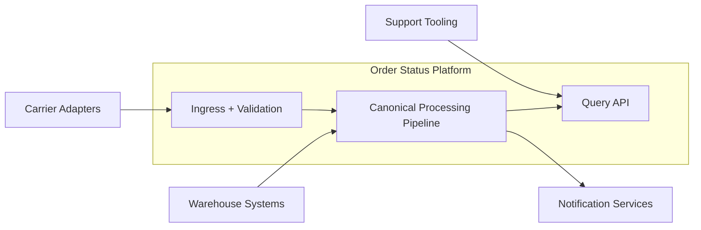
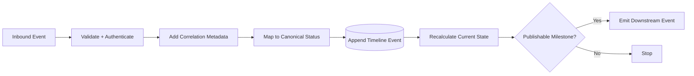
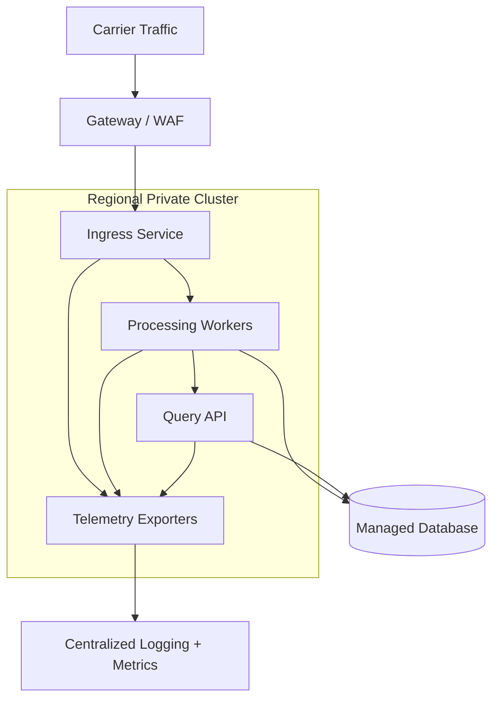

# High-Level Design (HLD): Order Status Platform

- **Status:** Approved
- **Version:** 1.0
- **Date:** 2026-03-19
- **Owner:** Commerce Platform Engineering
- **Reviewers:** Fulfillment, Support, Security, SRE
- **Related Documents:** ../requirements/prd.md, ../requirements/srs.md, ../governance/adr-001-canonical-order-timeline.md, system-architecture.md, interface-control.md

## 1. Purpose

This HLD explains the proposed design for the Order Status Platform and supports review of the main design decisions around ingestion, canonical modeling, storage, and downstream publication.

## 2. Scope

### 2.1 In Scope

- Shipment event ingestion
- Canonical mapping and state projection
- Timeline query API
- Milestone notification trigger publication

### 2.2 Out of Scope

- OMS write-back workflows
- Customer notification channel delivery

## 3. Business and Technical Context

### 3.1 Background

The commerce organization needs a single source of truth for order shipment status because warehouse systems, carrier feeds, and support tooling currently disagree on status definitions and timing.

### 3.2 Goals and Success Criteria

- Deliver a trusted canonical timeline for each shipped order.
- Publish customer-facing milestones within five minutes at p95.
- Achieve 99.9% monthly availability for read access.
- Reduce support friction by replacing manual status reconciliation.

### 3.3 Assumptions and Constraints

- Only domestic shipments are included in phase one.
- Carrier adapters normalize authentication and basic payload shape before forwarding events.
- The platform remains read-only with respect to source systems.

## 4. Architectural Drivers

### 4.1 Functional Drivers

- Aggregate multiple shipment event sources.
- Normalize states into a canonical timeline.
- Serve current and historical order status.
- Emit milestone events for notifications.

### 4.2 Non-Functional Drivers

- Availability: 99.9% monthly for read API
- Performance: event processing under five minutes at p95
- Security: mTLS or signed service auth for internal consumers; authenticated external webhook ingress
- Scalability: handle 10x holiday peak volume without architecture changes
- Operability: replay support, DLQ handling, and freshness alerting

## 5. Solution Overview

### 5.1 Proposed Design Summary

The design separates ingestion, canonical mapping, storage, and read concerns. This allows source-specific adapters to evolve independently while keeping the core status model and API stable.

### 5.2 Context Diagram

Context includes warehouse systems and carrier adapters as upstream event producers, the Order Status Platform as the canonical processing service, and support tooling plus notification services as downstream consumers.

### 5.3 Building Blocks

| Building Block | Responsibility | Key Interfaces | Notes |
| --- | --- | --- | --- |
| Source adapters | Receive or consume external shipment events | Webhook endpoint, event bus | Validate source identity |
| Normalization pipeline | Deduplicate and map events | Internal queue and mapper | Applies event ordering rules |
| Timeline store | Persist event history and current state | SQL tables | Supports auditing and API reads |
| Query API | Return state snapshots and timelines | REST JSON | Paginates timeline history |
| Notification publisher | Emit milestone events | Event topic | Publishes only on meaningful state change |

### 5.4 Data Flow Overview

Each inbound event is validated, enriched with correlation metadata, mapped to a canonical state, stored in the timeline table, and compared with the current state snapshot. If the state changed to a publishable milestone, a downstream event is emitted.

### 5.5 Deployment / Topology Overview

Containers run in a regional cluster with autoscaling enabled for ingress and processing workloads. A managed database stores both event history and current-state projections. Operational telemetry flows to centralized logging and metrics systems.

## 6. Key Design Decisions

| Decision | Rationale | Alternatives Considered | Impact |
| --- | --- | --- | --- |
| Use a canonical status model owned by the platform | Simplifies downstream integrations and support workflows | Pass-through source statuses | Requires initial mapping effort |
| Persist immutable timeline events plus a current-state projection | Supports auditability and fast reads | Snapshot-only storage | Slightly higher storage cost |
| Publish notification triggers asynchronously | Decouples notification delivery from ingestion latency | Inline notification calls | Improves resilience and retry behavior |

## 7. Security, Privacy, and Compliance

- Authentication and authorization use gateway validation for carriers and service identities for internal clients.
- Only shipment and customer contact reference data is stored; no payment or credential data is retained.
- Structured logs exclude sensitive customer content and retain correlation IDs for audits.
- Threats include webhook abuse, replay attacks, and unauthorized support access; mitigations include auth, idempotency controls, and RBAC.

## 8. Reliability and Operations

- Availability expectation is 99.9% for reads and graceful backlog recovery for writes.
- Observability includes event freshness, processing success rate, API latency, and DLQ depth.
- Backup and restore rely on managed database snapshots and replayable event sources.
- Recovery from processor failures uses checkpoint replay and idempotent state writes.
- Ownership resides with Commerce Platform Engineering with SRE support for production incidents.

## 9. Dependencies and Risks

### 9.1 Dependencies

| Dependency | Type | Owner | Impact if Delayed |
| --- | --- | --- | --- |
| Warehouse event bus schema v1 | system | Fulfillment Engineering | Missing packed/shipped transitions |
| Carrier adapter service | team | Integrations Team | Reduced shipment visibility |
| Notification subscriber support | team | Customer Messaging | No outbound customer alerts |

### 9.2 Risks

| Risk | Likelihood | Impact | Mitigation |
| --- | --- | --- | --- |
| Canonical model misses a carrier-specific edge case | Medium | Wrong status display | Expand mapping review with ops and support |
| Peak seasonal load causes processing lag | Medium | Freshness SLO miss | Capacity testing and autoscaling thresholds |
| Support tool adopts API slowly | Low | Delayed business impact | Provide adapter and migration plan |

## 10. Open Questions

- Should delivery-estimate changes be stored as timeline events or metadata on the latest event?
- Is an event replay self-service tool needed in phase one or can operations own manual replay?

## 11. References

- ../requirements/prd.md
- ../requirements/srs.md
- ../governance/adr-001-canonical-order-timeline.md
