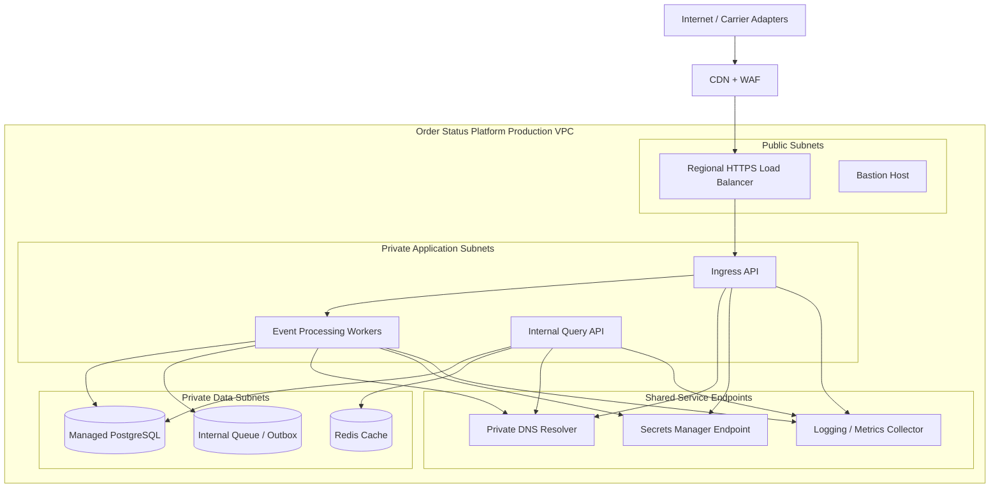
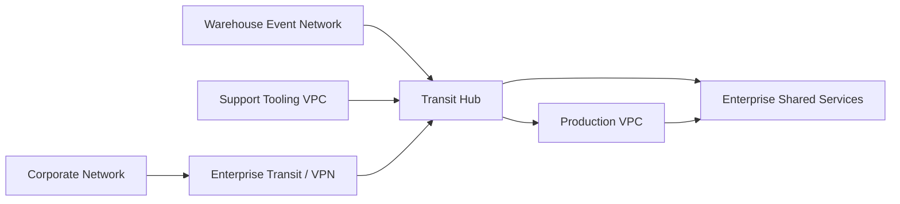
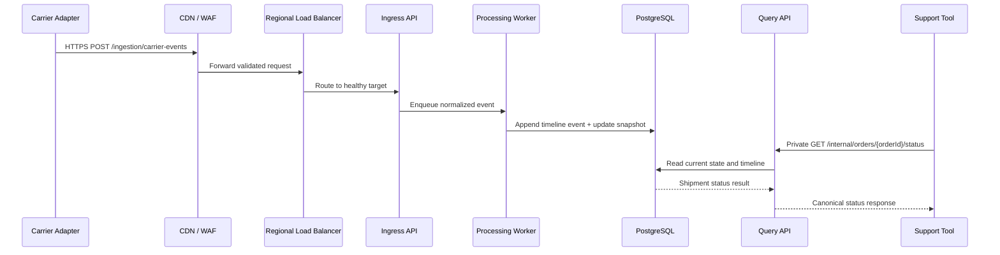
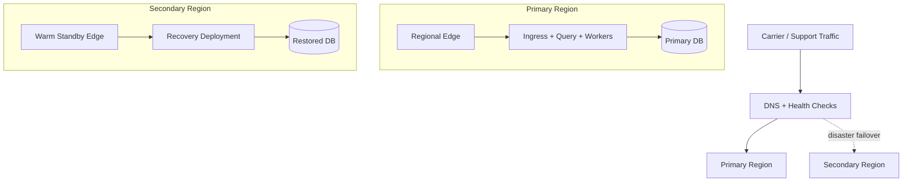

# Network Design Document: Order Status Platform

- **Status:** Approved
- **Version:** 1.0
- **Date:** 2026-03-23
- **Owner:** Commerce Platform Architecture
- **Reviewers:** Security Engineering, SRE, Integrations Team
- **Related Documents:** system-architecture.md, high-level-design.md, interface-control.md, ../operations/runbook.md

## 1. Overview

### 1.1 Purpose

Describe the production network topology for the Order Status Platform, including ingress, segmentation, trust boundaries, hybrid connectivity, and representative traffic flows used to support shipment status ingestion and internal reads.

### 1.2 Scope

This document covers the production cloud network for carrier webhook ingress, private application and data tiers, shared enterprise services, and hybrid connectivity back to corporate and warehouse networks. Application code internals, support UI browser networking, and carrier-owned networks beyond the approved ingress path are out of scope.

### 1.3 Stakeholders

| Stakeholder | Role | Interest |
| --- | --- | --- |
| Commerce Platform Engineering | Service owner | Reliable and supportable runtime connectivity |
| Security Engineering | Control owner | Enforce segmentation, ingress controls, and encryption |
| Site Reliability Engineering | Operations | Resilience, observability, and failover readiness |
| Integrations Team | Upstream integration owner | Stable and secure carrier webhook connectivity |
| Fulfillment Engineering | Enterprise dependency owner | Connectivity from warehouse event sources |

## 2. Design Context

### 2.1 Business and Operational Drivers

- Carrier-originated shipment updates must reach the platform with strong ingress controls and low latency.
- Internal support and service consumers need private, authenticated access to read APIs.
- Security policy requires separation between internet-facing, application, and data-processing zones.
- The platform must continue to serve read traffic during single-zone failures and support controlled recovery from regional incidents.
- Centralized DNS, secrets access, logging, and metrics collection are required enterprise dependencies.

### 2.2 Assumptions and Constraints

- Production is deployed in a single primary region with multi-availability-zone redundancy.
- Carrier webhooks enter through a managed CDN/WAF and regional load balancer; direct internet access to workloads is prohibited.
- Warehouse-originated events arrive from the corporate network through a private transit attachment rather than public endpoints.
- Database and cache tiers do not permit direct access from the corporate network.
- Administrative access is limited to approved SRE operators through bastion and identity-aware controls.

### 2.3 Current State (Optional)

Today, shipment events traverse separate carrier-specific endpoints and warehouse-owned consumers. The target design consolidates those paths into a single ingress pattern with consistent controls, while moving support reads from ad hoc database access to a private API.

## 3. Target Network Architecture

### 3.1 Architecture Summary

The target network places internet ingress in a tightly controlled edge layer, isolates stateless platform services in private application subnets, and confines persistent data stores to separate private data subnets. Corporate and warehouse connectivity enters through a transit hub, while shared DNS, secrets, and telemetry services are consumed over private endpoints.

### 3.2 High-Level Network Topology

### 3.3 Segmentation and Trust Boundaries

| Zone / Segment | Purpose | Allowed Ingress | Allowed Egress | Key Controls |
| --- | --- | --- | --- | --- |
| Edge ingress | Accept carrier webhook traffic | Internet via CDN/WAF | Private application subnets on HTTPS | WAF policy, rate limiting, TLS 1.2+, managed certificates |
| Public admin | Controlled operator entry point | Corporate VPN users with privileged identity | Private application subnets over SSH/session management | MFA, short-lived credentials, audit logging |
| Private application | Run ingestion, processing, and query services | Edge load balancer, bastion, transit hub service mesh | Data subnets, shared endpoints, transit hub | Security groups, workload identity, no public IPs |
| Private data | Store relational state and cache data | Private application subnets only | Shared backup and monitoring endpoints | Network ACLs, SG allowlists, encryption at rest |
| Shared services | Provide DNS, secrets, observability | Private application and data subnets | Enterprise-managed services | Private endpoints, service policies |

### 3.4 Hybrid / External Connectivity

Carrier networks connect only to the public ingress path through the CDN/WAF. Corporate users and warehouse event sources use private enterprise connectivity through the transit hub. Support tooling uses private east-west connectivity to the internal query API and does not traverse public endpoints.

## 4. Addressing and Naming

### 4.1 IP Addressing Plan

| Environment | Zone / Subnet | CIDR | Region / Site | Notes |
| --- | --- | --- | --- | --- |
| Production | Public AZ-A | 10.40.0.0/24 | us-east primary | Load balancer and bastion |
| Production | Public AZ-B | 10.40.1.0/24 | us-east primary | Load balancer failover |
| Production | Private App AZ-A | 10.40.10.0/24 | us-east primary | Ingress and worker nodes |
| Production | Private App AZ-B | 10.40.11.0/24 | us-east primary | Query API and worker nodes |
| Production | Private Data AZ-A | 10.40.20.0/24 | us-east primary | Primary database and cache |
| Production | Private Data AZ-B | 10.40.21.0/24 | us-east primary | Standby database and cache |
| Production | Shared Endpoints | 10.40.30.0/24 | us-east primary | DNS, secrets, telemetry endpoints |

### 4.2 DNS and Naming Standards

- Public carrier ingress hostname: `carrier-ingest.order-status.example.com`
- Private read API hostname: `order-status-api.prod.corp.example.net`
- Workload naming pattern: `<service>-<env>-<az>-<ordinal>`
- Security groups and route tables follow the prefix `osp-prod-<zone>-<purpose>`

## 5. Traffic Flow Design

### 5.1 North-South Traffic

Inbound webhook traffic uses HTTPS from carrier adapters to the CDN/WAF, then forwards to the regional load balancer and ingress API. Only `443/TCP` is exposed publicly. Outbound internet access from workloads is denied by default except for approved managed service endpoints accessed via NAT or private endpoints.

### 5.2 East-West Traffic

Internal application services communicate over private subnets using mutual TLS or service identity controls. Query API traffic from support tooling enters through the transit hub and private service mesh gateway. Processing workers can reach the database, cache, internal queue, DNS, secrets, and observability endpoints; they cannot initiate arbitrary connections to corporate user networks.

### 5.3 Example Request Flow

### 5.4 Port and Protocol Matrix

| Source | Destination | Protocol | Port | Purpose | Notes |
| --- | --- | --- | --- | --- | --- |
| Internet carrier adapters | CDN/WAF | HTTPS | 443 | Webhook ingress | Source IP filtering where supported |
| CDN/WAF | Regional load balancer | HTTPS | 443 | Forward validated traffic | Managed certificate trust |
| Load balancer | Ingress API | HTTPS | 8443 | Application ingress | Private target group only |
| Processing workers | PostgreSQL | TCP | 5432 | Timeline and snapshot persistence | SG allowlist |
| Query API | PostgreSQL | TCP | 5432 | Read current status and history | Read-only DB credentials |
| Query API | Redis cache | TCP | 6379 | Read caching | TLS enabled |
| Support tooling VPC | Query API | HTTPS | 443 | Private status API access | Transit hub + service identity |
| Application services | Observability collector | HTTPS / gRPC | 443 / 4317 | Logs, metrics, traces | Private endpoint preferred |

## 6. Routing and Resilience

### 6.1 Routing Strategy

Public subnets advertise only the load balancer and bastion routes through the internet gateway. Private application and data subnets use separate route tables with default egress through NAT for approved outbound dependencies, while enterprise destinations route through the transit gateway. Route summarization advertises the production VPC as `10.40.0.0/16` to the enterprise network to simplify hybrid routing.

### 6.2 High Availability and Failover

The production deployment spans two availability zones with redundant application nodes, database standby capacity, and duplicated shared service endpoints. Edge routing can remove unhealthy targets automatically. Regional failover uses backup restoration and infrastructure recreation in a secondary region documented in the operations runbook.

## 7. Security Design

### 7.1 Trust Model

The network assumes zero trust between zones: internet clients are untrusted, corporate networks are conditionally trusted after identity verification, and workload-to-workload traffic requires explicit policy and authenticated service identity.

### 7.2 Firewalls, ACLs, and Security Groups

- WAF blocks malformed payloads, geo-restricted traffic where applicable, and known abusive patterns.
- Security groups allow only documented service-to-service paths.
- Network ACLs add subnet-level deny controls for data-tier isolation.
- Administrative ports are never open to the public internet.

### 7.3 Remote Administration

SRE operators connect through the corporate VPN to the bastion host or approved session-management service. Direct SSH to private workloads is disabled unless a break-glass procedure is activated and logged.

### 7.4 Encryption

- All public and private HTTP traffic uses TLS 1.2 or better.
- Service-to-service authentication uses mTLS or signed workload identity tokens.
- Database and cache connections require TLS.
- Transit hub links are encrypted using enterprise-managed VPN or private circuit controls.

## 8. Network Services and Dependencies

- Private DNS resolver for service discovery and enterprise zones
- Secrets manager private endpoint for runtime credential retrieval
- Central logging, metrics, and tracing collectors
- NAT gateway for approved outbound updates and managed service access
- Transit gateway attachment for warehouse and support network paths

## 9. Operational Considerations

- Monitor load balancer health, WAF blocks, ingress latency, and failed private endpoint connections.
- Test security group and route-table changes in staging before production rollout.
- Validate AZ failover quarterly using synthetic carrier webhook and support API traffic.
- Review carrier source allowlists and enterprise route advertisements at least quarterly.
