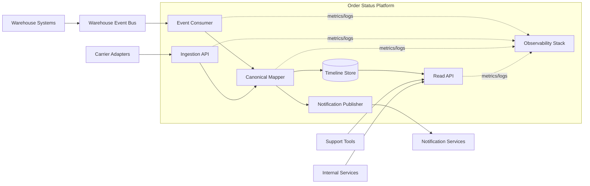
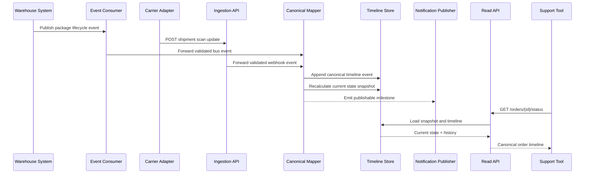

# System Architecture Document: Order Status Platform

- **Status:** Approved
- **Version:** 1.0
- **Date:** 2026-03-19
- **Owner:** Commerce Platform Architecture
- **Reviewers:** Support Engineering, Fulfillment Engineering, Security
- **Related Documents:** requirements/prd.md, requirements/srs.md, governance/adr-001-canonical-order-timeline.md

## 1. Purpose

Describe the end-to-end architecture for the Order Status Platform, including external dependencies, trust boundaries, data flows, and deployment model.

## 2. Scope

### 2.1 In Scope

- Event ingestion from warehouse and carrier systems
- Canonical timeline storage and state projection
- Internal read API and notification trigger emission
- Operational telemetry and replay support

### 2.2 Out of Scope

- Order creation and payment workflows
- Carrier label generation and return processing

## 3. System Context

Users and systems interact with the platform through four major paths:

1. Warehouse systems publish package lifecycle events to the event bus.
2. Carrier adapters receive scan updates and forward them to the ingestion API.
3. Support tools and internal services query the read API.
4. Notification services subscribe to milestone events emitted by the platform.

## 4. Architectural Overview

| Component | Responsibility | Interfaces | Notes |
| --- | --- | --- | --- |
| Ingestion API | Accept carrier webhooks and validate payloads | HTTPS webhook endpoint | Performs schema validation and auth checks |
| Event Consumer | Reads warehouse events from bus | Kafka topic consumer | Supports replay from checkpoints |
| Canonical Mapper | Translates source events to canonical statuses | Internal processing interface | Owns mapping rules and idempotency logic |
| Timeline Store | Persists normalized events and current state projection | Managed relational database | Stores timeline and current snapshot tables |
| Read API | Serves status and timeline reads | Internal REST API | Used by support tools and services |
| Notification Publisher | Emits milestone triggers | Event topic publisher | Filters only publishable state changes |
| Observability Stack | Metrics, logs, alerts, traces | Metrics and logging sinks | Monitors freshness and failure conditions |

## 5. Interfaces and Data Flow

Inbound events enter through either the bus consumer or webhook endpoint, pass schema validation and deduplication, then flow through the canonical mapper. Accepted events are appended to the timeline store, current state is recalculated, and milestone events are conditionally published. Read clients query the current state snapshot and join timeline rows when historical detail is requested.

## 6. Deployment View

The platform runs in three environments: development, staging, and production. Stateless compute components are deployed as containers in a private cluster. The database is a managed regional instance with automated backups. Public ingress is limited to the carrier webhook endpoint behind a gateway and web application firewall. Internal consumers access the read API through service mesh authentication.

## 7. Constraints and Quality Attributes

- High freshness for status updates is prioritized over strong global ordering across all sources.
- Timeline integrity requires immutable event persistence.
- Security requires authenticated integrations and least-privilege API access.
- Availability targets focus on the read API and core event processing pipeline.

## 8. Risks and Mitigations

| Risk | Likelihood | Impact | Mitigation |
| --- | --- | --- | --- |
| Carrier sends duplicate or out-of-order events | High | Incorrect customer updates | Idempotency keys, event-time ordering, and late-event handling rules |
| Database write contention during peak periods | Medium | Increased processing latency | Batched writes and partitioning by shipment key |
| Webhook abuse or malformed traffic | Medium | Service instability | Gateway rate limits, auth, and schema rejection |

## 9. References

- requirements/prd.md
- requirements/srs.md
- architecture/high-level-design.md
- architecture/interface-control.md
