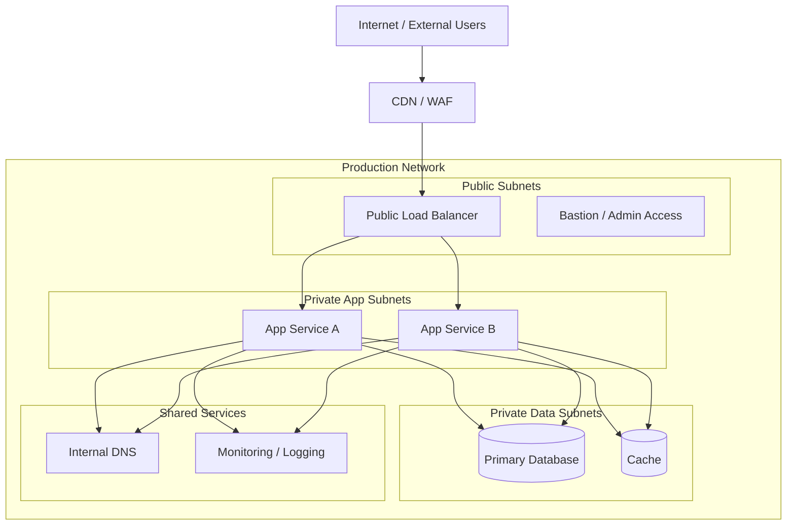
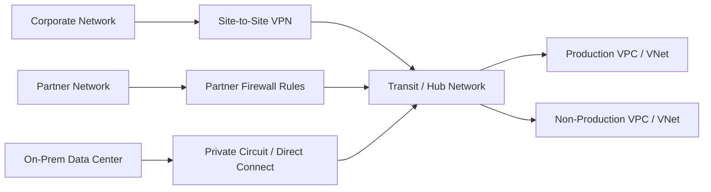
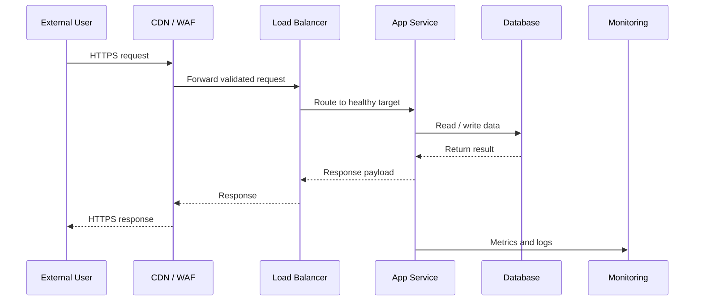
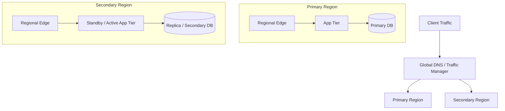

# Network Design Document: <system-name>

- **Status:** Draft | In Review | Approved | Superseded
- **Version:** <version>
- **Date:** <yyyy-mm-dd>
- **Owner:** <name / team>
- **Reviewers:** <names>

## 1. Overview

### 1.1 Purpose

Explain the purpose of this network design document, the solution or environment it covers, and the decisions it is intended to support.

### 1.2 Scope

Describe what environments, network paths, zones, and integration points are included and excluded.

### 1.3 Stakeholders

| Stakeholder | Role | Interest |
| --- | --- | --- |
| <name/team> | <role> | <interest> |

## 2. Design Context

### 2.1 Business and Operational Drivers

Summarize the availability, security, compliance, performance, geographic, and support drivers that shape the network design.

### 2.2 Assumptions and Constraints

- <assumption or constraint>

### 2.3 Current State (Optional)

Describe the current topology, legacy dependencies, known limitations, and migration considerations.

## 3. Target Network Architecture

### 3.1 Architecture Summary

Provide a concise narrative of the target network topology, major segments, trust boundaries, and critical connectivity paths.

### 3.2 High-Level Network Topology

Use this section for an at-a-glance view of internet ingress, edge controls, core application tiers, and shared services.

### 3.3 Segmentation and Trust Boundaries

Document the purpose of each network zone, who or what may initiate traffic into it, and what controls enforce separation.

| Zone / Segment | Purpose | Allowed Ingress | Allowed Egress | Key Controls |
| --- | --- | --- | --- | --- |
| <zone> | <purpose> | <sources> | <destinations> | <controls> |

### 3.4 Hybrid / External Connectivity

Capture links to partner systems, data centers, branches, cloud providers, or shared enterprise services.

## 4. Addressing and Naming

### 4.1 IP Addressing Plan

Describe CIDR allocations, subnet purposes, overlap considerations, and reserved ranges.

| Environment | Zone / Subnet | CIDR | Region / Site | Notes |
| --- | --- | --- | --- | --- |
| <env> | <zone> | <cidr> | <location> | <notes> |

### 4.2 DNS and Naming Standards

Document naming conventions for hosts, load balancers, network objects, and DNS zones.

## 5. Traffic Flow Design

### 5.1 North-South Traffic

Describe inbound and outbound traffic, edge protections, TLS termination, and public exposure rules.

### 5.2 East-West Traffic

Describe service-to-service communication patterns and controls between internal tiers.

### 5.3 Example Request Flow

Use this section to show a representative flow through the network from client ingress to backend persistence.

### 5.4 Port and Protocol Matrix

| Source | Destination | Protocol | Port | Purpose | Notes |
| --- | --- | --- | --- | --- | --- |
| <source> | <destination> | <protocol> | <port> | <purpose> | <notes> |

## 6. Routing and Resilience

### 6.1 Routing Strategy

Document routing domains, route propagation rules, summarization, and asymmetric routing considerations.

### 6.2 High Availability and Failover

Describe redundancy across zones, sites, regions, links, and devices.

## 7. Security Design

### 7.1 Trust Model

Explain network trust assumptions, administrative boundaries, and identity dependencies.

### 7.2 Firewalls, ACLs, and Security Groups

Summarize policy intent and reference the authoritative rule sets if they are maintained elsewhere.

### 7.3 Remote Administration

Describe bastions, VPN requirements, privileged access flows, and break-glass procedures.

### 7.4 Encryption

Document encryption requirements for internet traffic, east-west traffic, and site-to-site links.

## 8. Network Services and Dependencies

- DNS
- DHCP (if applicable)
- NTP / time sync
- Load balancing
- NAT / proxy services
- Service discovery
- Monitoring, logging, and flow records

## 9. Observability and Operations

### 9.1 Monitoring and Alerting

Describe what will be monitored for links, devices, gateways, load balancers, latency, packet loss, and throughput.

### 9.2 Logging and Audit

Describe firewall logs, flow logs, DNS logs, configuration audit trails, and retention requirements.

### 9.3 Operational Procedures

Reference runbooks for change windows, incident response, maintenance, and escalation.

## 10. Risks, Open Questions, and Decisions

### 10.1 Risks

| Risk | Impact | Likelihood | Mitigation | Owner |
| --- | --- | --- | --- | --- |
| <risk> | <impact> | <likelihood> | <mitigation> | <owner> |

### 10.2 Open Questions

- <question>

### 10.3 Key Decisions

- <decision> (link to ADR if applicable)

## 11. Validation and Rollout

### 11.1 Validation Approach

Describe connectivity testing, failover testing, security validation, and performance verification.

### 11.2 Migration / Implementation Plan

Describe rollout phases, cutover strategy, fallback steps, and success criteria.

## 12. References

- Related system architecture document
- Related HLD / DLD
- ADRs
- Interface control documents
- Security standards
- Operations runbooks
