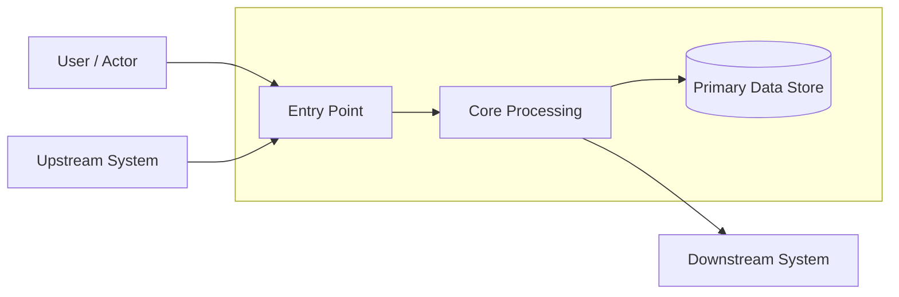
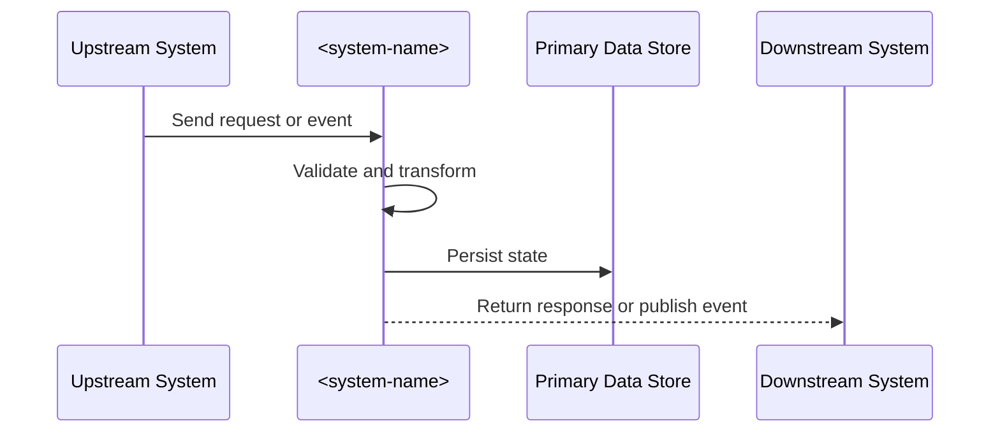
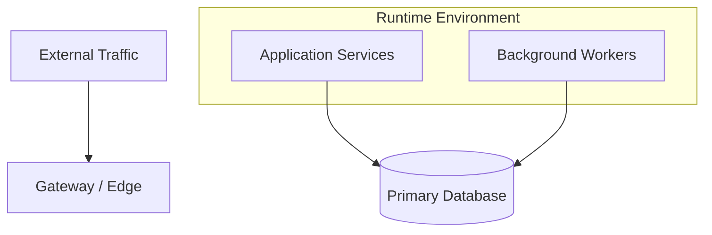

# System Architecture Document: <system-name>

- **Status:** Draft | In Review | Approved | Superseded
- **Version:** <version>
- **Date:** <yyyy-mm-dd>
- **Owner:** <name / team>
- **Reviewers:** <names>

## 1. Overview

### 1.1 Purpose

Explain why this system exists and what this document is intended to communicate.

### 1.2 Scope

Describe what is included and excluded.

### 1.3 Stakeholders

| Stakeholder | Role | Interest |
| --- | --- | --- |
| <name/team> | <role> | <interest> |

## 2. System Context

### 2.1 Business Context

Summarize the business workflow, mission need, or user problem being solved.

### 2.2 Context Diagram

Insert or link a system context diagram. Mermaid is recommended for diagrams stored directly in this Markdown document.

### 2.3 External Dependencies

| Dependency | Type | Purpose | Owner |
| --- | --- | --- | --- |
| <dependency> | <system/service/vendor> | <purpose> | <owner> |

## 3. Architectural Drivers

### 3.1 Functional Drivers

- <functional driver>

### 3.2 Quality Attributes

- Performance: <target>
- Availability: <target>
- Security: <target>
- Scalability: <target>
- Maintainability: <target>

### 3.3 Constraints and Assumptions

- <constraint or assumption>

## 4. Architecture Description

### 4.1 High-Level Design

Describe the major subsystems and responsibilities.

### 4.2 Component View

| Component | Responsibility | Interfaces | Notes |
| --- | --- | --- | --- |
| <component> | <responsibility> | <interfaces> | <notes> |

### 4.3 Data Flow

Describe key data movements, transformations, and persistence boundaries. Mermaid `flowchart` and `sequenceDiagram` blocks work well here.

### 4.4 Deployment View

Describe runtime topology, environments, infrastructure, and trust boundaries. Mermaid `flowchart` blocks can capture environment and trust-boundary views inline.

## 5. Interfaces

Reference interface specifications, APIs, protocols, and event contracts.

## 6. Security and Privacy

- Authentication and authorization approach
- Data classification and handling
- Secrets and key management
- Logging, monitoring, and audit needs
- Threats and mitigations

## 7. Reliability and Operations

- Backup and restore expectations
- Monitoring and alerting strategy
- Failure modes and recovery approach
- Support model and on-call ownership

## 8. Risks and Technical Debt

| Risk / Debt Item | Impact | Likelihood | Mitigation / Plan |
| --- | --- | --- | --- |
| <item> | <impact> | <likelihood> | <plan> |

## 9. Open Questions

- <question>

## 10. References

- <reference>
